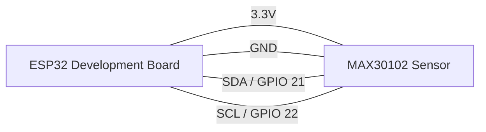

# Vital Sense: ESP32 Health Monitor (BPM & SpO2)

A premium, real-time health monitoring system using the ESP32 and MAX30102 sensor. This project features a high-performance web dashboard with live PPG waveform plotting, heart rate (BPM) tracking, and oxygen saturation (SpO2) monitoring.


## 🚀 Features

- **Live PPG Waveform**: High-speed (30Hz) real-time plotting of the actual heartbeat pulse.
- **Heart Metrics**: Near-instant BPM calculation and stabilized SpO2 tracking.
- **Modern Web Dashboard**: Dark-mode, responsive UI built with vanilla JS and Chart.js.
- **Dynamic Frequency Tuning**: Adjustable WebSocket update rate (1Hz - 100Hz) controlled via a web slider.
- **Intelligent Watchdog**: Automatic sensor recovery and re-initialization on I2C communication failure.
- **Session Intelligence**: Instant "lock-on" logic that resets buffers on finger removal for immediate new readings.

## 🛠 hardware Requirements

- **Microcontroller**: ESP32 (Any standard DevKit).
- **Sensor**: MAX30102 (Pulse Oximeter and Heart-Rate Sensor).
- **Wiring**: 4 Jumpers (I2C interface).

### Wiring Diagram



## 💻 Software Setup

### 1. Arduino IDE
Ensure you have the [Arduino IDE](https://www.arduino.cc/en/software) installed and the ESP32 board support added (Tools > Board > Boards Manager > search for "esp32").

### 2. Required Libraries
Install the following libraries via the Arduino Library Manager (Tools > Manage Libraries):
- **SparkFun MAX3010x Pulse and Proximity Sensor Library**
- **ESPAsyncWebServer**
- **AsyncTCP**

### 3. Repository Structure
```text
Heart-Monitor/
├── Heart-Monitor.ino   # Main firmware logic
├── web_index.h         # Embedded HTML/JS/CSS dashboard
└── README.md           # Documentation
```

## 🚀 Quick Start

1. **Clone the repository** to your local machine.
2. Open `Heart-Monitor.ino` in the Arduino IDE.
3. Update your **WiFi credentials** in the `Heart-Monitor.ino` file:
   ```cpp
   const char *ssid = "YOUR_WIFI_SSID";
   const char *password = "YOUR_WIFI_PASSWORD";
   ```
4. **Upload** the code to your ESP32.
5. Open the **Serial Monitor** (115200 baud) to find the ESP32's IP address.
6. Open your web browser and navigate to `http://<ESP32_IP_ADDRESS>`.

## ⚠️ Troubleshooting & Tips

### Sensor Placement
- **Light Pressure**: Do not press too hard! Excessive pressure can restrict blood flow in the finger, leading to inaccurate readings. Rest your finger lightly on the sensor.
- **Ambient Light**: The MAX30102 is sensitive to sunlight and incandescent bulbs. Cover the sensor/finger if readings are erratic.
- **Movement**: Stay still during the "Waiting for pulse lock" phase for the most accurate BPM calculation.

### SpO2 Reliability
- If SpO2 is consistently below 94%, try using your index or middle finger and ensuring the sensor is clean. The project uses a stabilized ratio-of-ratios algorithm for calculation.

## 📄 License

This project is licensed under the MIT License - see the LICENSE file for details.

## 🙏 Acknowledgments

- [SparkFun](https://github.com/sparkfun/SparkFun_MAX3010x_Sensor_Library) for the excellent sensor library.
- [Chart.js](https://www.chartjs.org/) for the beautiful real-time charts.
